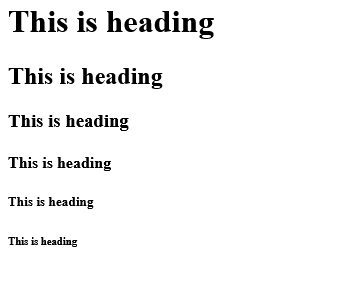
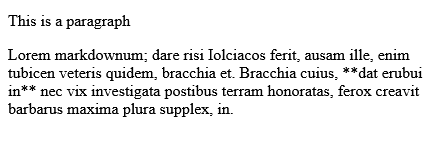
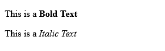

# Summary of Text Elements lecture

In this lecture, Jonas Schmedtmann has explained all Tags related to texts in HTML.

## #1 Heading Tags

We start with the first element, Its Heading tags, this tag contains 6 sizes, I will explaine below.

```html
<h1>This is heading</h1>
<h2>This is heading</h2>
<h3>This is heading</h3>
<h4>This is heading</h4>
<h5>This is heading</h5>
<h6>This is heading</h6>
```

These tags use only for the address of articles or the main headers of pages on the website only.
NOTE >> Do not use it to make large or small texts, and for best use don't use the `<h1>` more than one time.

> **_NOTE:_** Don't use it to make large or small texts, and for best use don't use the `<h1>` more than one time in your page.

## Result



## #2 Paragraph Tag

This tag is for adding any text paragraph to our page.

```html
<p>This is a paragraph</p>
<p>
  Lorem markdownum; dare risi Iolciacos ferit, ausam ille, enim tubicen veteris
  quidem, bracchia et. Bracchia cuius, **dat erubui in** nec vix investigata
  postibus terram honoratas, ferox creavit barbarus maxima plura supplex, in.
</p>
```

## Result



## #3 How to format text

For text formats like bold text or italic text.

### 1- Bold text

We have two ways to do this in HTML.\
First way can use `<b></b>` tag

```html
<p>This is a <b>paragraph</b></p>
```

or

Second way can use `<strong></strong>` tag

```html
<p>This is a <strong>paragraph</strong></p>
```

In these ways, the result is the same

### 2- Italic text

We have two ways to make text is Italic in HTML.\
First way can use `<i></i>` tag

```html
<p>This is a <i>paragraph</i></p>
```

or

Second way can use `<em></em>` tag.\
em >> shorthand for "Emphasize".

```html
<p>This is a <em>paragraph</em></p>
```

In these ways, the result is the same

### Result



> **_NOTE:_** The most common use of bold tag and italic tag, We use bold tag `<strong>` and italic tag `<em>` because these tags are the semantic HTML, will know more info about semantic HTML in the next sections
