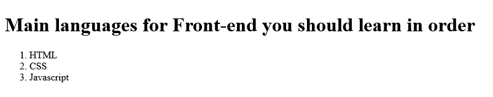
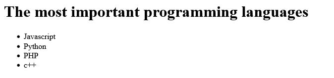

# What is the lists in HTML

There are Two list types in HTML: ordered list — used to group a set of related items in a specific order.\
unordered list — used to group a set of related items in no particular order.

## 1- Ordered list

```html
<h1>Main languages for Front-end you should learn in order</h1>
<ol>
  <li>HTML</li>
  <li>CSS</li>
  <li>Javascript</li>
</ol>
```

## Explain Tags

`<ol></ol>` => Is shorthand for Ordered List\
`<li></li>` => Is shorthand for List Item

### Result



## 2- Unordered list

```html
<h1>The most important programming languages</h1>
<ul>
  <li>Javascript</li>
  <li>Python</li>
  <li>PHP</li>
  <li>c++</li>
</ul>
```

## Explain Tags

`<ul></ul>` => Is shorthand for Unordered List\
`<li></li>` => Is shorthand for List Item

### Result


