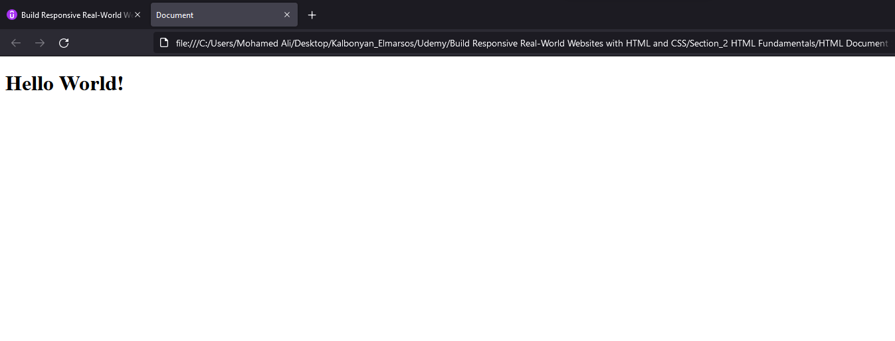

# Summary of section

## 1- Introduction to HTML

What is HTML ?

- HTML is shortcut of (Hypertext Markup language)
- HTML is a markup language that web developers use to structure and describe the content of a webpage (not a programming language).
- HTML consists of elements that describe different types of content: paragraphs, links, headings, images, video, etc.
- Web browsers understand HTML and render HTML code as websites

### Anatomy of an HTML element

```html
<!-- Element -->
<p>This is a pragraph tag</p>
```

### Explain the element

| Syntax                   | Description                                                                                                               |
| ------------------------ | ------------------------------------------------------------------------------------------------------------------------- |
| `<p>`                    | Name of the element, wrapped in < > this is calld (Opening Tag or Starting Tag)                                           |
| "This is a pragraph tag" | Content of the element, in this example text. But it might be another element (child element)                             |
| `</p>`                   | this is calld (Closing Tag or Endig Tag) Same as opening tag, but with a ( / ), When element has no content, it’s omitted |

NOTE >> Some elements have no content (e.g. ``)

## 2- HTML Document Structure

To create an HTML file you must give an extension (.html), For the browsers know it is an HTML file
After creating an HTML file, this file must be added the main tags

```html
<!-- This tag tell the browser that this document uses HTML language -->
<!DOCTYPE html>

<!-- The main tag is the HTML tag this tag contains all of the HTML language tags -->
<html>
  <!-- head tag this tag contains all settings for HTML document, any content between this tag is not visible in the browser -->
  <head>
    <!-- title tag this tag for the name of the website, the content for this tag is visible in a tab for the browser -->
    <title>Document</title>
    <!-- this is a closing tag for title tag </title> -->
  </head>
  <!-- this is a closing tag for head tag </bead> -->

  <!-- body tag this tag contains for any content we need to visible on our website such as (paragraphs, links, headings, images, videos, etc) -->
  <body>
    <!-- h1 tag this tag for heading, the content text between this tag will be visible only on our website -->
    <h1>Hello World!</h1>
    <!-- this is a closing tag for h1 tag </h1> -->
  </body>
  <!-- this is a closing tag for body tag </body> -->
</html>
<!-- this is a closing tag for HTML tag </html> -->
```

### Result


