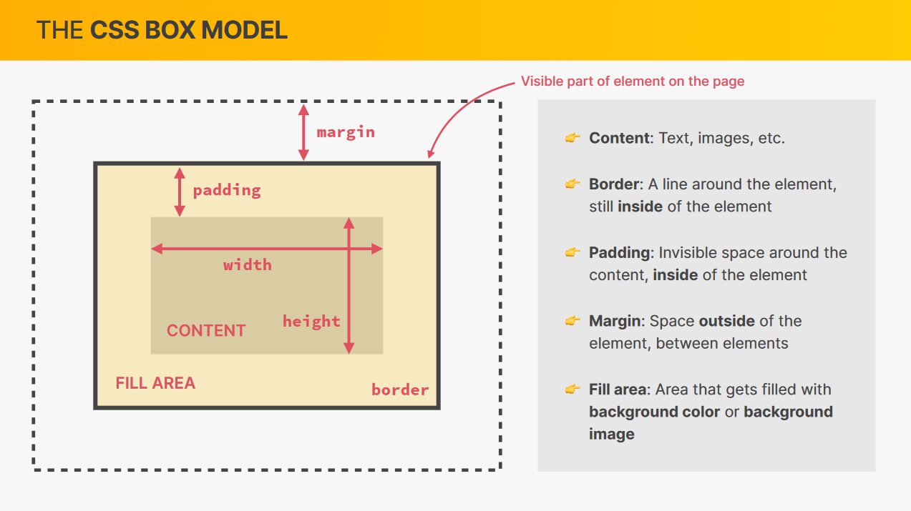

# CSS Box model

The CSS box model is a container that contains multiple properties including borders, margin, padding, and the content itself. It is used to create the design and layout of web pages. It can be used as a toolkit for customizing the layout of different elements. The web browser renders every element as a rectangular box according to the CSS box model. Box-Model has multiple properties in CSS. Some of them are given below:

- Content Area: This area consists of content like text, images, or other media content. It is bounded by the content edge and it- dimensions are given by content-box width and height.
- Padding Area: It includes the element’s padding. This area is actually the space around the content area and within the border-box. It- dimensions are given by the width of the padding-box and the height of the padding-box.
- Border Area: It is the area between the box’s padding and margin. Its dimensions are given by the width and height of the border.
- Margin Area: This area consists of space between border and margin. The dimensions of the Margin area are the margin-box width and th- margin-box height. It is useful to separate the element from its neighbors.

