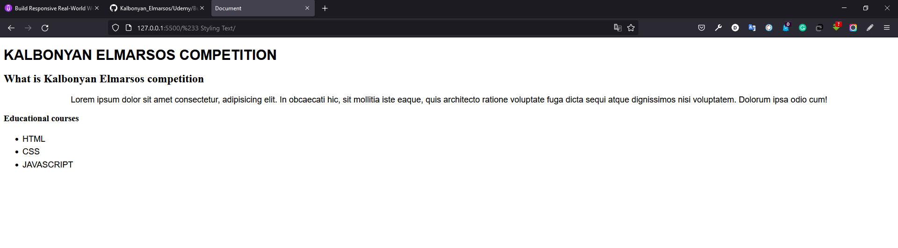

# Styling text

For styling the text in your HTML page can use the next properties in CSS

```css
h1 {
  font-size: 30px;
  font-family: sans-serif;
  text-transform: uppercase;
}

p {
  font-family: sans-serif;
  text-align: center;
  font-size: 25px;
}

ul {
  font-family: sans-serif;
  font-style: bold;
  line-height: 1.5;
  font-size: 20px;
}
```

## Explain code

- `font-size` This property for setting the size of the text
- `font-family` This property is set to font type
- `text-transform` This property for setting the format of text like uppercase or lowercase
- `text-align` This property for text-align, to center or right or left
- `font-style` This property for makes text styles like bold or italic
- `line-height` This property for controls the space between lines of text

## Result


