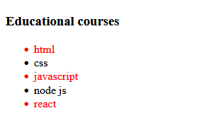

# What is Pseudo-class selectors in CSS

CSS pseudo-classes are used to add styles to selectors, but only when those selectors meet certain conditions. A pseudo class is expressed by adding a colon `(:)` after a selector in CSS, followed by a pseudo-class such as `:first-child`, `:last-child`, or `:nth-child()`.

## :first-child

The `:first-child` is a pseudo class in CSS which represents the first element among a group of sibling elements. The `:first-child` Selector is used to target the first child element of it's parent for styling.

### Example

```css
li:first-child {
  color: red;
}
```

#### Result


## :last-child

The `:last-child` is a pseudo-class in CSS which represents the last element among a group of sibling elements. The `:last-child` Selector is used to target the last child element of its parent for styling.

### Example

```css
li:last-child {
  color: red;
}
```

#### Result


## :nth-child()

The `:nth-child()` is a CSS pseudo-class selector that allows you to select elements based on their index (source order) inside their container.

You can pass in a positive number as an argument to `:nth-child()`, which will select the one element whose index inside its parent matches the argument of `:nth-child()`. For example, `li:nth-child(3)` will select the list item with an index value 3; that is, it will select the third list item.

You can also pass in one of two predefined keywords: `even` and `odd`. `li:nth-child(even)` will select all list items with even index numbers (2, 4, 6, 8, etc.), and `li:nth-child(odd)` will select all list items with odd index numbers (1, 3, 5, 7, etc.).

### Example

```css
li:nth-child(3) {
  color: red;
}
```


### Example

```css
li:nth-child(even) {
  color: red;
}
```


### Example

```css
li:nth-child(odd) {
  color: red;
}
```



> **_TIP_:** There are more pseudo-classes in CSS are not just those
