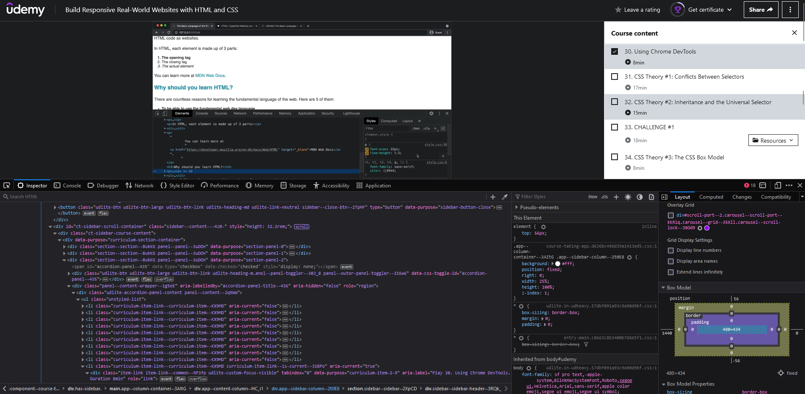

# What is Developer Tools or DevTools?

Web development tools (often called devtools or inspect element) allow web developers to test and debug their code.\
They are tools used for testing the user interface of a website or web application.\
Web development tools allow developers to work with a variety of web technologies, including HTML, CSS, the DOM, JavaScript, and other components that are handled by the web browser.

## how can access devtools?

We have three ways

- 1- By the keyboard you can click on `Ctrl + Shift + i`
- 2- By pressing the right mouse key then choosing the inspect from the list
- 3- By pressing a `F12` key from the keyboard

## Result

