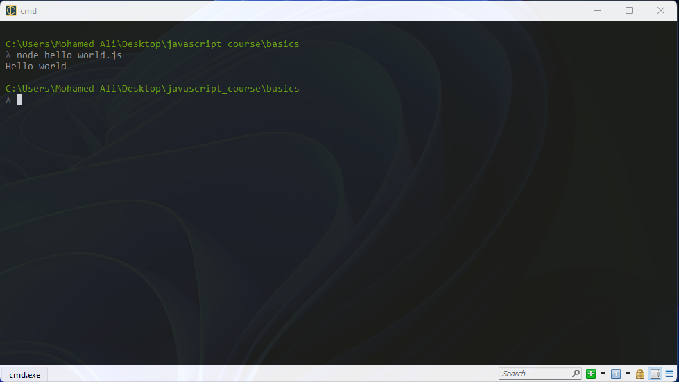

# Section 2: Setting up Your Machine

In this section, I prepared the development environment on my machine.

## 1- The first thing I did is installed [Vscode](https://code.visualstudio.com/)

Visual Studio Code is a free open source text editor by Microsoft. VS Code is available for Windows, Linux, and macOS. Although the editor is relatively lightweight, it includes some powerful features that have made VS Code one of the most popular development environment tools in recent times.

VS Code supports a wide array of programming languages from Javascript, Java, C++, and Python to CSS, Go, and Dockerfile. Moreover, VS Code allows you to add on and even creating new extensions including code linters, debuggers

- Some extensions were also installed to facilitate the writing of the code like
    - [Babel ES6/ES7](https://marketplace.visualstudio.com/items?itemName=dzannotti.vscode-babel-coloring)
    - [Sublime Text Keymap](https://marketplace.visualstudio.com/items?itemName=ms-vscode.sublime-keybindings)


## 2- The second thing I did is installed [Node.js](https://nodejs.org/en/)

Node.js is an open-source, cross-platform, back-end JavaScript runtime environment that runs on the V8 engine and executes JavaScript code outside a web browser

Node js allows us to run JavaScript files on our machine.


## 3- The last thing I did is installed [Cmder](https://cmder.net/)

Cmder is Console Emulator for Windows


### I also learned in this section some terminal orders 

```bash
// Clear the terminal output
clear
```

```bash
// Print current working directory
pwd 
```

```bash
// Change directory
cd  
```

```bash
// Change the directory to backspace
cd ../

// Change the directory to 2 backspace
cd ../../ 
```

## Hello javascript 

### In this video, I learned the first code in javascript and how to run the code using node.js

```js
// This code for printing the result on the terminal
console.log('Hello world')
```

```sh
// For run the Javascript code on the terminal using node.js
node hello_world.js
```

### Example

